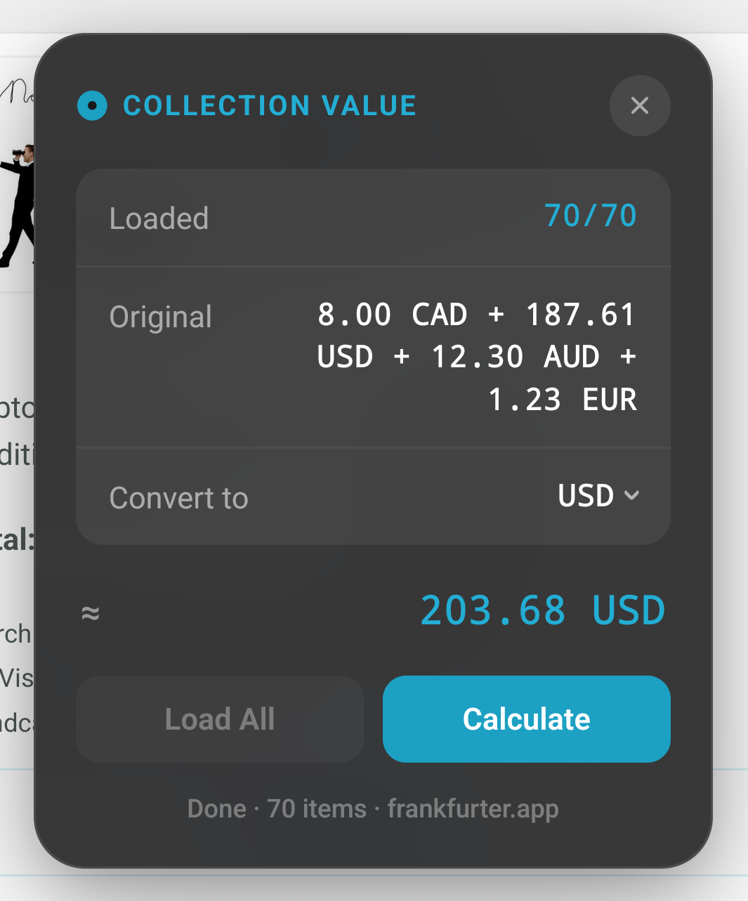

### repo moved to:
https://git.maws.lol/jolly/bandcamp-collection-value

# Bandcamp Collection Value

A userscript that calculates the total value of your Bandcamp purchases and converts it to any currency.

## Installation

1. Install [Tampermonkey](https://www.tampermonkey.net/) or [Violentmonkey](https://violentmonkey.github.io/)
2. Install the script from [Greasy Fork](https://greasyfork.org/en/scripts/578935-bandcamp-collection-value), or manually by adding `bandcamp-collection-value.js`

## Usage

1. Go to your Bandcamp purchases
2. Click the circle in the bottom-right corner to open the widget
3. Hit **Load All** to load your full purchase history
4. Select your target currency, then hit **Calculate**

## Compatibility

Tested on Firefox (Android & desktop). Should work on any browser with Tampermonkey or Violentmonkey.

## License

[GPL-3.0-or-later](https://www.gnu.org/licenses/gpl-3.0.html) © 2026 Jolly
